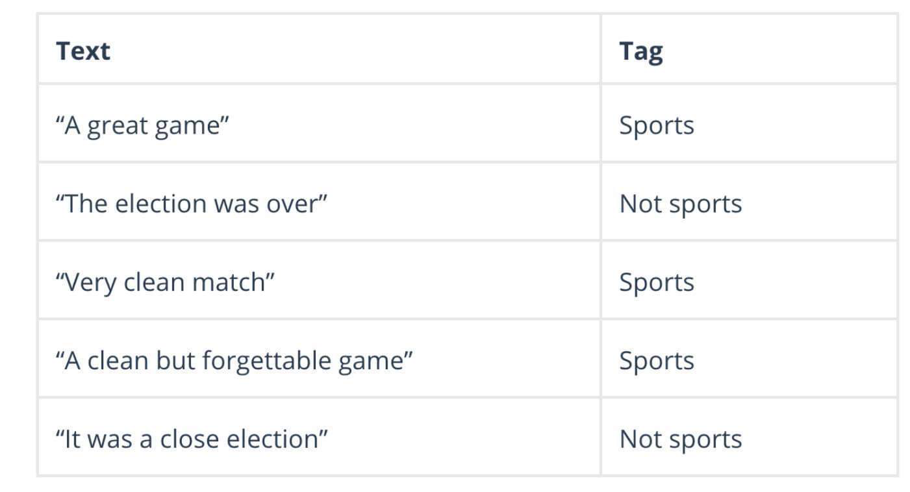
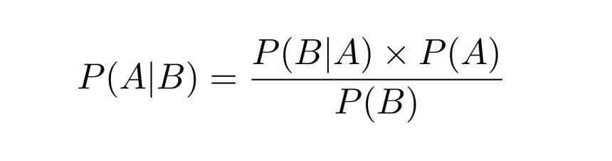
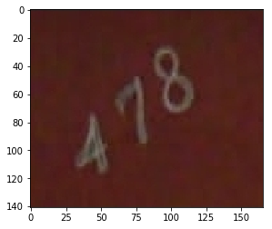
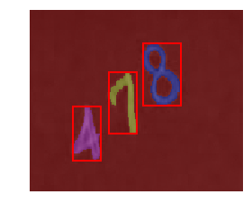
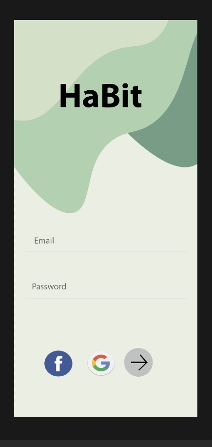
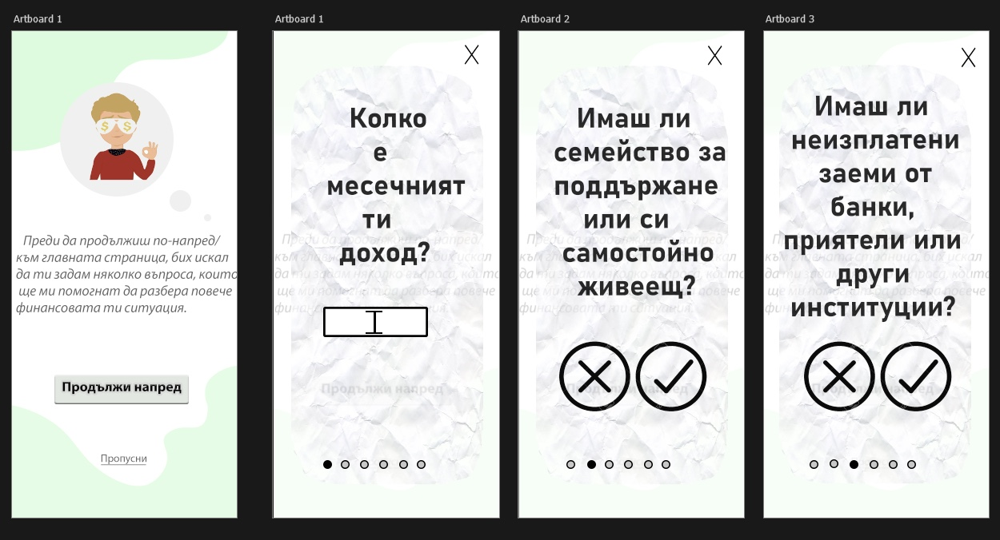
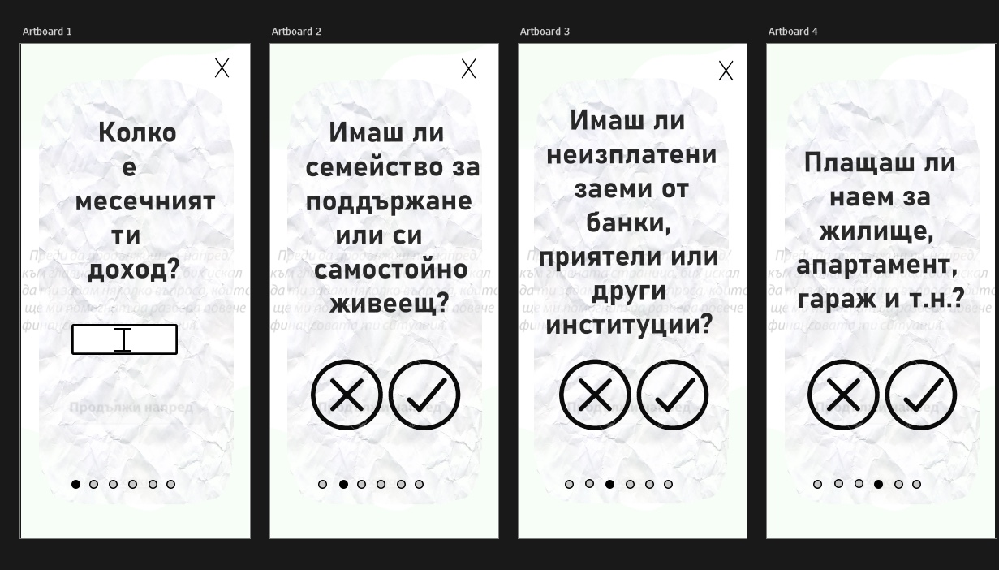
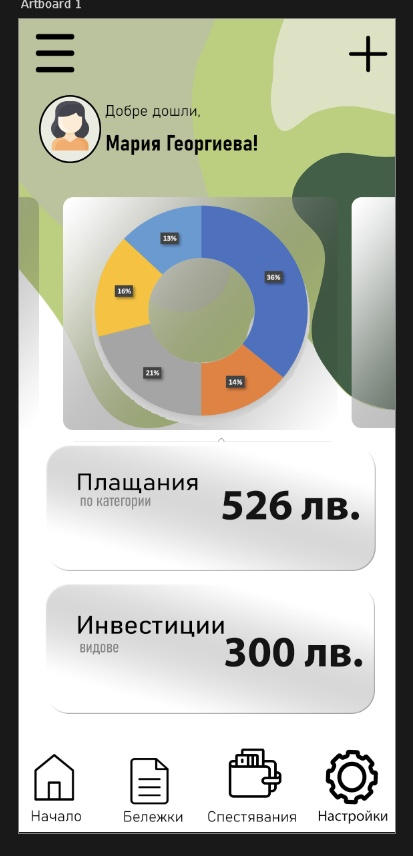

# HaBit

## Тема
- Cash flow management

## Team
- Leader - Денислав Тащан
- Data & Machine Learning Designer - Виктория Начева
- Deep Learning Designer - София Желева
- Application Designer - Анелия Кичукова

## Algorithmic solutions
-NLG (Natural Language Generation)- за генериране на цялостният финансов отчет.

-Naive Bayes - изчислява възможността дадена база от данни да принадлежи към определена
категория или не. При анализ на текст може да се използва за категоризиране на думи или
фрази като принадлежащи към предварително зададен „таг“ (класификация) или не.



-OCR (Optical Character Recognition) - Използва се за четене на текст от изображения
и за конвертирането му в текстови данни. (Откриване на текст → Разпознаване → Извличане
до откриване → Разпознаване)

-
-

### Предварителна обработка(Preprocessing)

#### Instalation

```bash
pip install opencv-python
Here’s the code for thresholding.
```


#### Usage

```python
import cv2
import numpy as np
from matplotlib import pyplot as plt

# Read the image
img = cv2.imread('receipt.jpg',0)
# Simple thresholding
ret,thresh1 = cv2.threshold(img,210,255,cv2.THRESH_BINARY)
cv2.imshow(thresh1,’gray’)
```

## Очакван Резултат
Приложението ни (което също ще се казва HaBit) има за цел да помага на хората, организирайки
разходите, сметките и доходите им на едно място. Специалното на HaBit е A.I. имплементацията, 
която смятаме да добавим, а именно сканиране на касови бонове и организиране на разходите
на потребителя в категории (например: храна, ток, вода, дрехи, гориво,...). Целта на HaBit
е да даде на потребителя бързо и удобно решение за проблемите с месечния бюджет, месечни
разходи и спестени пари на месец. Една от функциите на HaBit ще бъде да съхранява копие на
касовите ви бележки под формата на снимка или текстов файл за бърз и удобен достъп 
(например ако искате да върнете закупен от вас продукт, но не сте от типа хора, които
пазят касови бележки).

### Как ще изглежда приложението:






## Възможности за развитие
За сега приложението ни е само на етап идея и базова разработка, но една от идеите ни за
в бъдеще е, използвайки coockies технологията, приложението да изпраща нотификации и 
имейли на потребителите за намаления, предожения или нови продукти от местата, където
най-често пазаруват(например: Lidl, Billa, WC Waikiki, Megami, Shell, LUKOIL, 
McDonalds, KFC, ...).

## Note!
Това не е приложение за онлайн банкиране!
